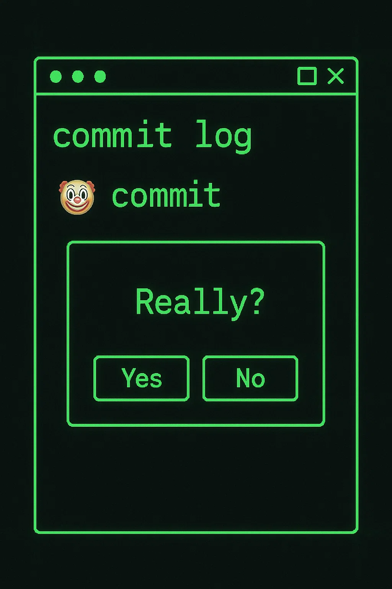

# 🤖 GitHub AI Code Reviewer

An AI-powered GitHub App that reviews your code and provides constructive feedback on pull requests and issues.



## 🚀 Features

- Automatically reviews code in pull requests
- Provides feedback on issues
- Integrates with OpenAI for intelligent code analysis

## 🛠️ Technologies Used

- [Deno](https://deno.land/)
- [OpenAI API](https://openai.com/api/)
- [GitHub Webhooks](https://docs.github.com/en/webhooks)

## 📦 Installation

1. **Clone the repository:**

   ```bash
   git clone https://github.com/Nathanmedo/PushShamer.git

2. **Navigate to the project directory:**
    ```bash
    cd ai-code-reviewer

3. **Install dependencies:**
    Deno handles dependencies via URL imports. Ensure you have Deno installed.

4. **Set up environment variables:**

    Create a .env file and add your OpenAI API key:
    ```bash
    OPENAI_API_KEY=your-api-key

## 🧪 Testing Locally

1. **Start the server**
    ```bash
    deno run --allow-net --allow-read --allow-env main.ts

2. **Simulate a webhook:**
    Use Postman or curl to send a POST request to http://localhost:8000/ with a sample payload.


## 📄 License
    This project is licensed under the MIT License.

    ```yaml   
        If you need assistance with setting up the GitHub App or further customization, feel free to ask!
        ::contentReference[oaicite:1]{index=1}
 

